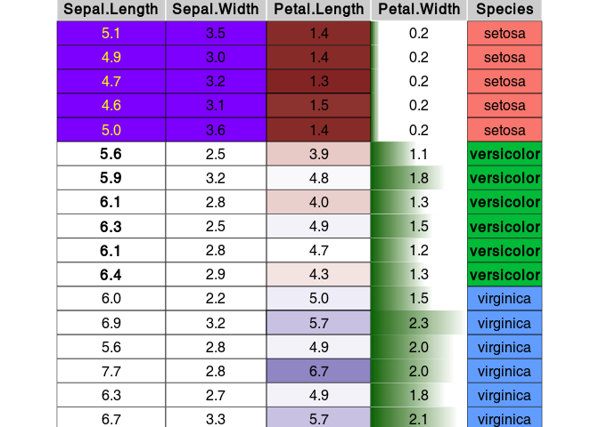

Introduction to condformat
================
Sergio Oller
2020-05-15

<!-- README.md is generated from README.Rmd. Please edit that file -->

condformat renders a data frame in which cells in columns are formatted
according to several rules or criteria.

<!-- badges: start -->

[](https://CRAN.R-project.org/package=condformat)
[](https://cran.r-project.org/package=condformat)

[](https://zeehio.github.io/condformat)

[](https://github.com/zeehio/condformat/actions)
[](https://codecov.io/github/zeehio/condformat)

<!-- badges: end -->

## Browse source code

Checkout the code and browse it at
<http://github.com/zeehio/condformat>.

## How to install condformat:

### Dependencies

If you want to use the PDF output you will need the `xcolor` LaTeX
package. Either use the full texlive distribution, or install
`latex-xcolor` on Debian and derivatives.

### Package installation

  - From CRAN:
    
        install.packages("condformat")

  - To install the latest development version:
    
        devtools::install_github("zeehio/condformat")

## Example

``` r
data(iris)
library(condformat)
condformat(iris[c(1:5,70:75, 120:125),]) %>%
  rule_fill_discrete(Species) %>%
  rule_fill_discrete(c(Sepal.Width, Sepal.Length),
                     expression = Sepal.Width > Sepal.Length - 2.25,
                     colours = c("TRUE" = "#7D00FF")) %>%
  rule_fill_gradient2(Petal.Length) %>%
  rule_text_bold(c(Sepal.Length, Species), Species == "versicolor") %>%
  rule_text_color(Sepal.Length,
                  expression = ifelse(Species == "setosa", "yellow", "")) %>%
  rule_fill_bar(Petal.Width, limits = c(0, NA)) %>%
  theme_grob(rows = NULL) %>%
  condformat2grob()
```

<!-- -->

This example covers most of the condformat rules.

## Rules and output engine support

| Rule                  | HTML | LaTeX | gtable | Excel |
| --------------------- | :--: | :---: | :----: | :---: |
| `rule_fill_discrete`  |  X   |   X   |   X    |   X   |
| `rule_fill_gradient`  |  X   |   X   |   X    |   X   |
| `rule_fill_gradient2` |  X   |   X   |   X    |   X   |
| `rule_text_color`     |  X   |   X   |   X    |   X   |
| `rule_text_bold`      |  X   |   X   |   X    |   X   |
| `rule_fill_bar`       |  X   |       |   X    |       |
| `rule_css`            |  X   |       |        |       |
